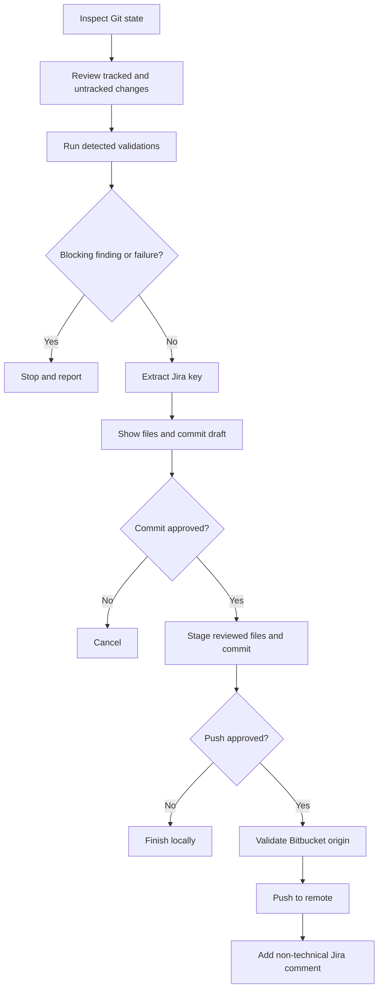

# kartini-agent-kit

<div align="center">

**A safe, repeatable path from local changes to a reviewed commit.**

Reusable Kar-Tini workflows for Codex and the terminal, with Jira and Bitbucket Cloud built into the workflow.

`/init` &nbsp;·&nbsp; `/ship-code` &nbsp;·&nbsp; `kartini init` &nbsp;·&nbsp; `kartini ship-code`

</div>

> [!IMPORTANT]
> `ship-code` never pushes automatically. It requires a Jira ticket, validates the change, asks before committing, asks again before pushing, and comments on Jira only after a successful push.

## Contents

- [What it provides](#what-it-provides)
- [Quick start](#quick-start)
- [The ship-code workflow](#the-ship-code-workflow)
- [Validation behavior](#validation-behavior)
- [Configuration](#configuration)
- [Development](#development)
- [Troubleshooting](#troubleshooting)
- [Documentation](#documentation)

## What it provides

| Interface | Command | Purpose |
| --- | --- | --- |
| Codex skill | `/init` | Configure and validate Jira/Bitbucket access |
| Codex skill | `/ship-code` | Safely review and ship the current Git changes |
| Terminal CLI | `kartini init` | Same setup flow from a shell |
| Terminal CLI | `kartini ship-code` | Same deterministic Git workflow from a shell |

The Codex skills add semantic review guidance; the CLI provides deterministic Git, validation, and integration operations.

## Quick start

### 1. Install the CLI

Recommended with `pipx`:

```bash
pipx install git+ssh://git@github.com/ammarbror/kartini-agent-kit.git
```

Or use a virtual environment:

```bash
git clone git@github.com:ammarbror/kartini-agent-kit.git
cd kartini-agent-kit
python3 -m venv .venv
source .venv/bin/activate
python3 -m pip install .
```

Verify the installation:

```bash
kartini --help
```

### 2. Install the Codex plugin

Register the GitHub repository as a Codex marketplace and install the plugin:

```bash
codex plugin marketplace add git@github.com:ammarbror/kartini-agent-kit.git --ref main
codex plugin add kartini-agent-kit@kartini-agent-kit
```

Restart Codex if the skills do not appear immediately. The installed skills are named `init` and `ship-code`.

### 3. Configure integrations

Run either:

```bash
kartini init
```

or in Codex:

```text
/init
```

The setup stores the configuration globally at:

```text
~/.config/kartini-agent-kit/config.env
```

The file is created with owner-only permissions. The expected variables are:

```env
BITBUCKET_EMAIL=your-email@example.com
BITBUCKET_API_TOKEN=your-bitbucket-api-token
JIRA_EMAIL=your-email@example.com
JIRA_API_TOKEN=your-jira-api-token
JIRA_URL=https://your-domain.atlassian.net
```

Never commit a real `.env` file or paste tokens into chat, issues, logs, or commit messages. Revoke and replace a token immediately if it is exposed.

## The `/ship-code` workflow

Run it from any Git project with a Jira key in the branch name, for example:

```bash
git checkout -b feature/KAIRA-654-payment-validation
kartini ship-code --summary "Add payment validation"
```



The workflow steps are:

1. Reads the repository root, current branch, staged/unstaged changes, and untracked files.
2. Groups changed files by application, tests, configuration, documentation, or other.
3. Reviews changed content for critical, high, and bug/regression findings.
4. Detects and runs available project validation commands.
5. Requires a Jira key such as `KAIRA-654` in the branch name.
6. Proposes a Conventional Commit, such as `feat(KAIRA-654): add payment validation`.
7. Shows the exact files to commit and asks for approval.
8. Stages only the reviewed file list.
9. Asks separately before pushing.
10. Verifies that `origin` is a Bitbucket Cloud repository accessible by the configured account.
11. Adds a non-technical Jira comment only after a successful push.

No push occurs automatically. A missing Jira ticket, blocking finding, failed validation, invalid Bitbucket remote, or missing integration configuration stops the relevant workflow step.

### CLI options

```text
kartini ship-code --summary "Short change summary"
kartini ship-code --yes                  # explicit commit approval
kartini ship-code --push                 # explicit push approval
kartini ship-code --no-prompt            # never prompt for push
```

Use `--yes` and `--push` only in automation where the approval boundary is intentional.

## Validation behavior

The CLI detects multiple checks instead of assuming that one test command represents the whole project:

| Project signal | Checks detected |
| --- | --- |
| `package.json` scripts | `lint`, `typecheck`, `test`, `build` when defined |
| Python project/tests | `pytest`, or `unittest discover` when pytest is unavailable |
| `Cargo.toml` | `cargo test` |
| `go.mod` | `go test ./...` |
| `tsconfig.json` | `npx tsc --noEmit` when no package typecheck script exists |

A non-zero validation result blocks commit. If no standard command is detected, the workflow reports that fact explicitly.

## Configuration

### Precedence

Configuration is loaded in this order, with later values overriding earlier values:

1. Global `~/.config/kartini-agent-kit/config.env`.
2. Project `.kartini.env`.
3. Project `.env`.
4. Matching process environment variables.

Project environment files must remain untracked. `.gitignore` already protects `.env` files except `.env.example`.

### Required variables

See [.env.example](.env.example) for the safe template. `kartini init` stores real values in the global local config; it does not modify the repository.

## Development

Run the test suite and package checks locally:

```bash
python3 -m unittest discover -s tests -v
python3 -m compileall -q kartini_agent_kit
python3 /path/to/plugin-creator/scripts/validate_plugin.py .
```

The implementation intentionally uses Python's standard library for HTTP, Git, config parsing, and testing so the CLI has a small installation surface.

## Repository layout

```text
kartini_agent_kit/       Shared CLI and workflow primitives
skills/init/             Codex /init skill
skills/ship-code/        Codex /ship-code skill
.codex-plugin/           Codex plugin manifest
tests/                   Unit tests
.env.example             Safe configuration template
pyproject.toml            Python package and kartini entry point
```

## Documentation

- [Architecture](docs/architecture.md) — boundaries between Codex, CLI, Git, and external APIs.
- [Security guidance](docs/security.md) — credential handling and approval boundaries.
- [`.env.example`](.env.example) — placeholder configuration only.

## Troubleshooting

### `No Jira ticket found`

Rename the branch to include a Jira key:

```text
feature/KAIRA-654-short-description
```

### `Push cancelled: Git remote 'origin' is not configured`

Add a Bitbucket Cloud remote and verify it:

```bash
git remote add origin git@bitbucket.org:workspace/repository.git
git remote -v
```

### `Push cancelled: ... not a Bitbucket Cloud URL`

The workflow intentionally refuses GitHub or other remotes. Check that `origin` uses either:

```text
git@bitbucket.org:workspace/repository.git
https://bitbucket.org/workspace/repository.git
```

### Jira or Bitbucket validation fails

Run `kartini init` again with fresh tokens. Do not print tokens while debugging; the CLI intentionally reports only sanitized connection errors.

## Release workflow

Plugin and CLI versions are defined in both `pyproject.toml` and `.codex-plugin/plugin.json`. Increase both values for a release, run the tests and plugin validator, push to `main`, then refresh the Codex marketplace.
