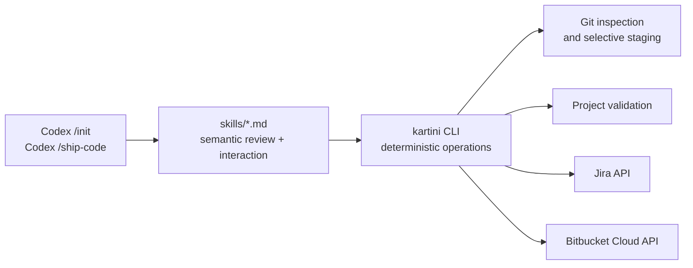

# Architecture

## Boundary between Codex and CLI

`kartini-agent-kit` has two adapters around one workflow concept:

The Codex skill is responsible for reasoning about behavior and regressions. The CLI is responsible for repeatable operations that should not depend on model interpretation.

## Safety boundaries

- Credentials are loaded only from known configuration keys.
- Credential values are never included in normal output or error messages.
- Untracked files are included in the review diff before staging.
- Only the reviewed changed-file list is staged.
- Commit and push are separate approval boundaries.
- Push requires a Bitbucket Cloud `origin` that the configured account can access.
- Jira comment creation occurs after push, never before.

The workflow intentionally separates reasoning from side effects: Codex decides whether the change is acceptable, while the CLI owns the exact Git and API operations.

## External API behavior

Jira uses the configured site URL and API v3 endpoints for account validation and issue comments. Bitbucket Cloud uses the authenticated account endpoint during initialization and the repository endpoint for the current Git `origin` before push.

The API adapter uses Python's standard library and returns sanitized errors. It does not attempt to retry mutations automatically, which avoids duplicate Jira comments.
